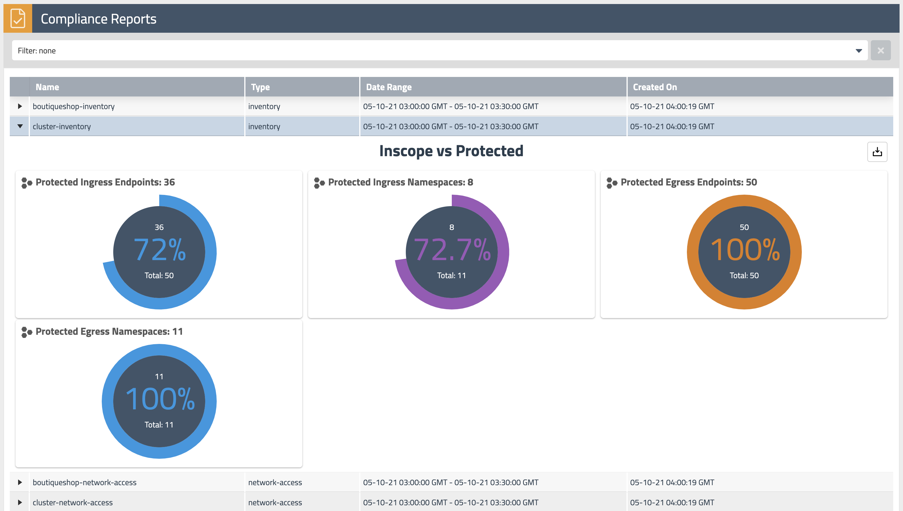

# Module 8-1: Compliance and Security-Compliance

**Goal:** Use global reports to satisfy compliance requirements.

## Steps

1. Use `Compliance Reports` view to see all generated reports.

    >We have deployed a few compliance reports in one of the first labs and by this time a few reports should have been already generated. If you don't see any reports, you can manually kick off report generation task. Follow the steps below if you need to do so.

    Calico provides `GlobalReport` resource to offer [Compliance reports](https://docs.tigera.io/compliance/compliance-reports/) capability. There are several types of reports that you can configure:

    - CIS benchmarks
    - Inventory
    - Network access
    - Policy audit

    >When using EKS cluster, you need to [enable and configure audit log collection](https://docs.tigera.io/compliance/compliance-reports/compliance-managed-cloud#enable-audit-logs-in-eks) on AWS side in order to get the data captured for the `policy-audit` reports.

    A compliance report could be configured to include only specific endpoints leveraging endpoint labels and selectors. Each report has the `schedule` field that determines how often the report is going to be generated and sets the timeframe for the data to be included into the report.

    Compliance reports organize data in a CSV format which can be downloaded and moved to a long term data storage to meet compliance requirements.

    

[Next -> Module 8-2](../modules/intrusion-detection-protection.md)

[Previous -> Module 7-2](../modules/host-protection.md)

[Menu](../README.md)