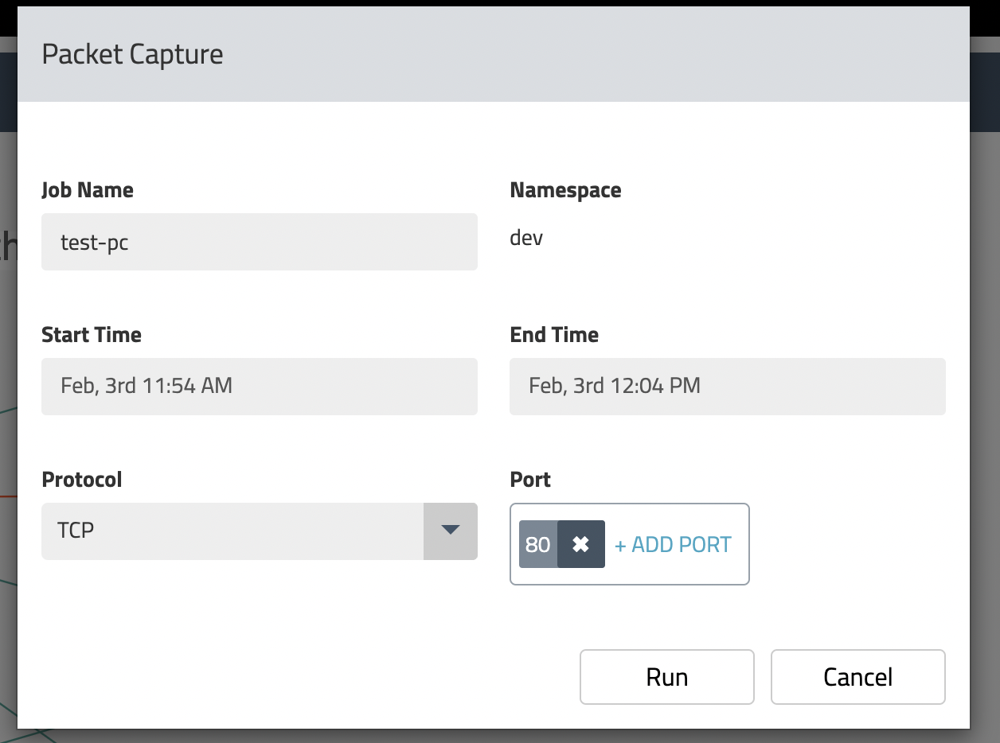
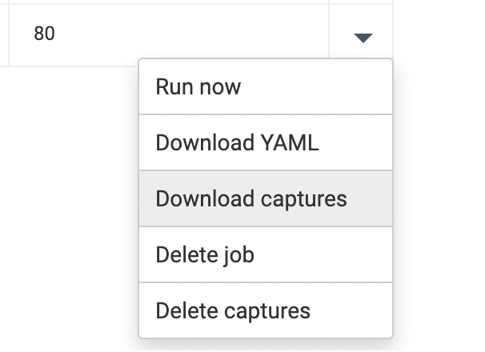

# Observability: Dynamic packet capture

**Goal:** Configure packet capture for specific pods and review captured payload. 

Calico enterprise/cloud provide enhanced packet capture feature for DevOps troubleshooting. Packet captures are Kubernetes Custom Resources and thus native Kubernetes RBAC can be used to control which users/groups can run and access Packet Captures; this may be useful if Compliance or Governance policies mandate strict controls on running Packet Captures for specific workloads. This demo is simplified without RBAC but further details can be found [here](https://docs.tigera.io/v3.10/visibility/packetcapture).


# Steps

## step 1. Capture all packet for nginx pods.

 1. Initial packet capture job from manager UI. 

  


 2. Schedule the packet capture job with specific port.

  


 3. You will see the job scheduled in service graph.


  


 4. Download the pcap file once the job is `Capturing` or `Finished`. 
   
  
   

 
## step 2. Capture packet per protocol for example `TCP` and port `3550`.

 1. Deploy packet capture definition to capture packets between `hipstershop/frontend` pod and `dev/netshoot` pod.

   ```bash
   kubectl apply -f demo/packet-capture/hipstershop-productcatalogservice-pcap.yaml
   ```

 2. Generate packet by running command:
  
   ```bash
   for i in {1..20}; do kubectl -n dev exec netshoot -- nc -zv productcatalogservice.hipstershop 3550; sleep 2; done
   ```

 3. Fetch and review captured payload.

  Retrieve captured `*.pcap` files and review the content.

   
    
 4. Stop packet capture

  

## step 3. Define different RBAC role for capture and fetch the payload from UI (will update it within next release)

>Packet Capture permissions are enforced using the standard Kubernetes RBAC based on Role and RoleBindings within a namespace. For demo purpose, we will create sa tester with create/delete/get/list/update/watch packet captures for '`dev` namespace:


[Next -> IDS/IPS](../modules/intrusion-detection-protection.md)

[Menu](../README.md)