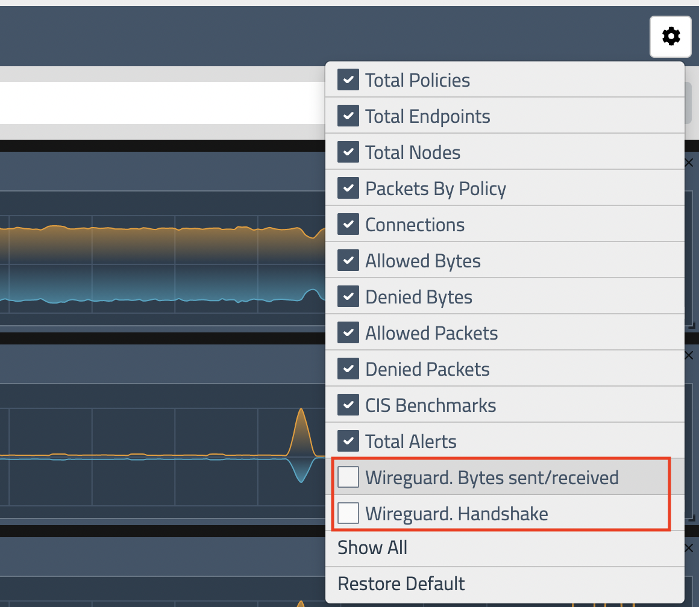
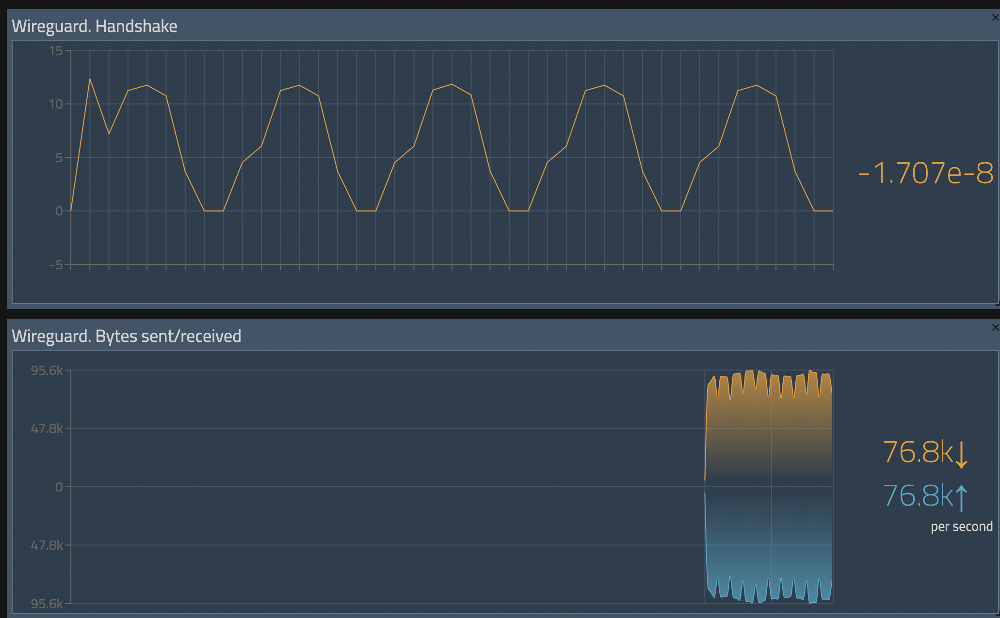

# Security: Wireguard Encryption

**Goal:** Enable wireguard as node to node encryption for data in transit 

> Wireguard enable layer 3 encryption, you can enable it with one command setting, we do everything else (interface, peer configuration, sharing public keys, route tables, ip rules, etc), Wireguard could be disabled/enabled on the entire cluster, or specific nodes, for specific nodes configuration, please refer to [doc](https://docs.tigera.io/compliance/encrypt-cluster-pod-traffic)

**Supported:** 

  The following platforms using only IPv4:
  Kubernetes on-premises, 
  EKS using Calico CNI, 
  EKS using AWS CNI, 
  AKS using Azure CNI

## Steps

### For EKS cluster

1. Enable WireGuard encryption across all the nodes using the following command.
    
   ```bash
   #For EKS, we will use the AWS key pair to SSH each node from cloud9. or you can use EC2 console for connecting to each nodes.
   ssh -i <path to the private key>/KEYPAIR_NAME.pem ec2-user@<Node_IP>
   ```

   ```bash
   sudo yum install kernel-devel-`uname -r` -y
   sudo yum install https://dl.fedoraproject.org/pub/epel/epel-release-latest-7.noarch.rpm -y
   sudo curl -o /etc/yum.repos.d/jdoss-wireguard-epel-7.repo https://copr.fedorainfracloud.org/coprs/jdoss/wireguard/repo/epel-7/jdoss-wireguard-epel-7.repo
   sudo yum install wireguard-dkms wireguard-tools -y
   ```

   Exit ssh from nodes and enable wireguard with kubectl in your cluster
   ```bash
   #Enable wireguard in your cluster
   kubectl patch felixconfiguration default --type='merge' -p '{"spec":{"wireguardEnabled":true}}'
   ```

   Output will be like this:
   ```bash
   felixconfiguration.projectcalico.org/default patched
   ```


2. Verify that the nodes are configured for WireGuard encryption. 
   
   ```bash
   NODE_NAME=$(kubectl get nodes -o jsonpath='{.items[*].status.addresses[?(@.type=="Hostname")].address}'| awk '{print $1;}')
   
   kubectl get node $NODE_NAME -o yaml | grep -B 2 -A 2 annotations

   ```

   > Output will be like:
   ```bash
   kind: Node
   metadata:
     annotations:
       node.alpha.kubernetes.io/ttl: "0"
       projectcalico.org/WireguardPublicKey: XXXXXX-YYYYYY-ZZZZZZZ
   ```

3. You can also verify it in one of the nodes, Calico will generate a wireguard interface as `wireguard.cali` 

   ```bash
   ssh -i <path to the private key>/KEYPAIR_NAME.pem ec2-user@<Node_IP>
   ```

   ```bash
   ifconfig | grep wireguard
   ```
   
   > Output will be like:
   ```bash
   wireguard.cali: flags=209<UP,POINTOPOINT,RUNNING,NOARP>  mtu  
   ```

   ```bash
   # wg command will show more detail
   sudo wg show
   ```
   > Output will be like:
   ```bash
   interface: wireguard.cali
   public key: XXXXXX-YYYYYY-ZZZZZZZ
   private key: (hidden)
   listening port: 51820
   fwmark: 0x200000

   peer: gUSZOGEK4xH6038gzLPVB5SigACnGtBNQJ/rApzOfxg=
   endpoint: 192.168.20.193:51820
   allowed ips: 192.168.19.148/32, 192.168.20.193/32, 192.168.17.167/32, 192.168.23.245/32, 192.168.30.158/32, 192.168.3.186/32, 3.136.20.213/32, 192.168.7.175/32
   latest handshake: 13 seconds ago
   transfer: 11.06 MiB received, 3.74 MiB sent
   ```
   > Note: If you have 3 nodes, you will see 2 peers in `wg show` 


### For AKS cluster 

1. Enable WireGuard encryption across all the nodes using the following command.

   > AKS cluster nodes run Ubuntu with a kernel that has WireGuard installed already, so there is no manual installation required.

   ```bash
   #Enable wireguard in your cluster
   kubectl patch felixconfiguration default --type='merge' -p '{"spec":{"wireguardEnabled":true}}'
   ```

   Output will be like this:
   ```bash
   felixconfiguration.projectcalico.org/default patched
   ```

2. Verify that the nodes are configured for WireGuard encryption. 
   
   ```bash
   NODE_NAME=$(kubectl get nodes -o jsonpath='{.items[*].status.addresses[?(@.type=="Hostname")].address}'| awk '{print $1;}')
   
   kubectl get node $NODE_NAME -o yaml | grep -B 2 -A 3 annotations

   ```

   > Output will be like:
   ```bash
   kind: Node
   metadata:
     annotations:
       csi.volume.kubernetes.io/nodeid: '{"disk.csi.azure.com":"aks-nodepool1-45823991-vmss000000","file.csi.azure.com":"aks-nodepool1-45823991-vmss000000"}'
       node.alpha.kubernetes.io/ttl: "0"
       projectcalico.org/WireguardPublicKey: XXXXXX-YYYYYY-ZZZZZZZ
   ```

3. You can also verify it in one of the nodes, Calico will generate a wireguard interface as `wireguard.cali` 

   ```bash
   ##This command starts a privileged container on your node and connects to it over SSH.
   kubectl debug node/$NODE_NAME -it --image=mcr.microsoft.com/aks/fundamental/base-ubuntu:v0.0.11
   ```
   Output will be like:
   ```bash
   Creating debugging pod node-debugger-aks-nodepool1-41939440-vmss000001-c9bjq with container debugger on node aks-nodepool1-41939440-vmss000001.
   If you don't see a command prompt, try pressing enter.
   ```

   ```bash
   ifconfig | grep wireguard
   ```
   
   Output will be like:
   ```bash
   root@aks-nodepool1-41939440-vmss000001:/# ifconfig | grep wireguard
   wireguard.cali: flags=209<UP,POINTOPOINT,RUNNING,NOARP>  mtu 
   root@aks-nodepool1-41939440-vmss000001:/#
   ```

4. *[Optional]* If you want install wg tool as root user in the node, then follow the instructions below in your cloudshell to generate the priviate key for your pod.
   ```bash 
   #add your RSA public key to nodes in VMSS, we need to use az vmss extension set and az vmss update-instances command.
   CLUSTER_RESOURCE_GROUP=$(az aks show --resource-group $RGNAME --name $CLUSTERNAME --query nodeResourceGroup -o tsv)
   SCALE_SET_NAME=$(az vmss list --resource-group $CLUSTER_RESOURCE_GROUP --query '[0].name' -o tsv)
   az vmss extension set \
   --resource-group $CLUSTER_RESOURCE_GROUP \
   --vmss-name $SCALE_SET_NAME \
   --name VMAccessForLinux \
   --publisher Microsoft.OSTCExtensions \
   --version 1.4 \
   --protected-settings "{\"username\":\"azureuser\", \"ssh_key\":\"$(cat ~/.ssh/id_rsa.pub)\"}"
   ```

   ```bash
   az vmss update-instances --instance-ids '*' \
   --resource-group $CLUSTER_RESOURCE_GROUP \
   --name $SCALE_SET_NAME
   ```

   ```bash
   ##This command create a privileged pod on your node and connects to it over SSH.
   kubectl run -it aks-ssh --image=mcr.microsoft.com/aks/fundamental/base-ubuntu:v0.0.11
   ```

   ```bash
   ##exit the ssh and confirm the pod `aks-ssh` is running in default ns.
   root@aks-ssh:/# exit
   exit
   ```

   ```text
   kubectl get pods
   NAME      READY   STATUS    RESTARTS   AG
   aks-ssh   1/1     Running   1          35s
   ```

   ```bash
   #run below command in cloudshell to get the private ssh key and copy to your pod. 
   kubectl cp ~/.ssh/id_rsa  aks-ssh:/id_rsa
   kubectl exec -it aks-ssh -- bash
   ```
   
   ```bash
   #Confirm the key is in your pod now.
   ls id_rsa
   chmod 400 id_rsa
   mkdir -p $HOME/.ssh
   cat << EOF > $HOME/.ssh/config
   Host *
   ServerAliveInterval 240
   EOF
   ```

   ```bash
   #use the private key to ssh to the node with node ip, and install wg tools.
   ssh -i id_rsa azureuser@<Node_IP>
   sudo apt update
   sudo apt install -y wireguard-tools
   sudo wg show
   ```

   
### For Kubeadm cluster


## *[Option]* Enable WireGuard statistics

> To access wireguard statistics, prometheus stats should be turned on.

```bash
kubectl patch installation.operator.tigera.io default --type merge -p '{"spec":{"nodeMetricsPort":9091}}'

kubectl apply -f demo/encryption/wireguard-statistics.yaml
```

> After enable the port and policy, choose to show the statistics in UI and you will be able to see wireguard statistics in manager UI.

  

  


## *[Option]* Disable WireGuard for a cluster

> To disable WireGuard on all nodes modify the default Felix configuration. 

```bash
kubectl patch felixconfiguration default --type='merge' -p '{"spec":{"wireguardEnabled":false}}'
```

[Next -> Host protection](../modules/host-protection.md)

[Menu](../README.md)