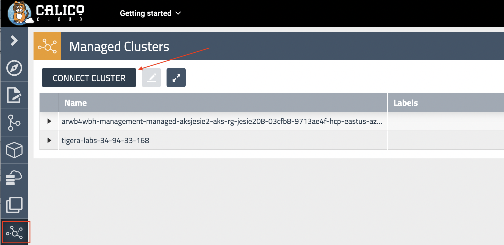
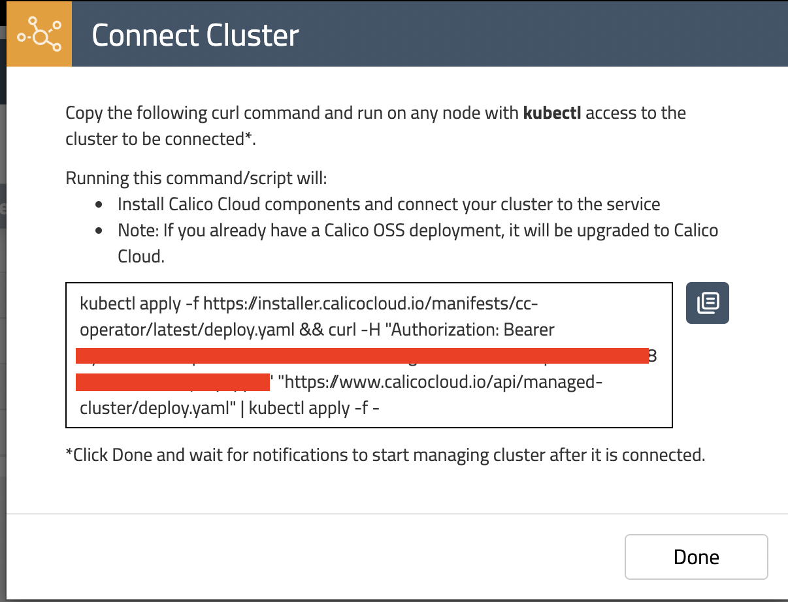

# Joining your cluster to Calico Cloud

**Goal:** Join cluster to Calico Cloud management plane.

IMPORTANT: In order to complete this module, you will need to create a [Calico Cloud trial account](https://www.calicocloud.io/). Issues with being unable to navigate menus in the UI are often due to browsers blocking scripts - please ensure that you disabled all blocker scripts.

## Step 1 - Creating a Calico Cloud trial account

1. Navigate to [https://www.calicocloud.io/](https://www.calicocloud.io/) and sign up for a 14 day trial account - no credit cards required. Provide a valid e-mail and create a password following the guidelines provided. Continue and a verification e-mail will be sent to the address you provided. 

    

2. You will receive the verification e-mail - if you did not received it after a few moments you registered check your SPAM folder. Click in the "VERIFY YOUR ACCOUNT" button in the e-mail. You should see a web pager with the email verification successed message. Click in the "Back to Calico Cloud" link to return to Calico Cloud. Enter your profile information and submit. In a few moments your trial environment will be ready for you to use.

    

This concludes the Calico Cloud trial account creation. From now on you have 14 days to test Calico Cloud. You can log in back at any time using the "Login as an Existing User" link in the [Calico Cloud](https://www.calicocloud.io/) website.

## Step 2 - Connecting your cluster to Calico Cloud.

1. When returning to the [Calico Cloud](https://www.calicocloud.io/) website, use the "Login as an Existing User" link, enter your e-mail and password to log back into your trial environment. Upon signing into the Calico Cloud UI the welcome screen will show four use cases which will give a tailored tour for learning more. You can select whichever better fits your needs. After that you can connect your first cluster. This option lead you to the Managed Clusters section. Click on the "Connect Cluster" button to start the process of connecting a new cluster.

    

2. The Connect Cluster window will allow you to choose the name of your cluster in Calico Cloud and specify what is the service you are using to run your Kubernetes cluster. The next window is  

    


   


3. Join your cluster to Calico Cloud management plane.
    
    Click the "Managed Cluster" in your left side of browser.
    
    
    Click on "connect cluster"
     

    choose your and click next, use aks as example
      


    Run installation script in your aks cluster. Script should look similar to this:
      


    > Output should look similar to:
    ```bash
    namespace/calico-cloud created
    customresourcedefinition.apiextensions.k8s.io/installers.operator.calicocloud.io created
    serviceaccount/calico-cloud-controller-manager created
    role.rbac.authorization.k8s.io/calico-cloud-leader-election-role created
    clusterrole.rbac.authorization.k8s.io/calico-cloud-metrics-reader created
    clusterrole.rbac.authorization.k8s.io/calico-cloud-proxy-role created
    rolebinding.rbac.authorization.k8s.io/calico-cloud-leader-election-rolebinding created
    clusterrolebinding.rbac.authorization.k8s.io/calico-cloud-installer-rbac created
    clusterrolebinding.rbac.authorization.k8s.io/calico-cloud-proxy-rolebinding created
    configmap/calico-cloud-manager-config created
    service/calico-cloud-controller-manager-metrics-service created
    deployment.apps/calico-cloud-controller-manager created
    % Total    % Received % Xferd  Average Speed   Time    Time     Time  Current
                                    Dload  Upload   Total   Spent    Left  Speed
    100   355  100   355    0     0    541      0 --:--:-- --:--:-- --:--:--   541
    secret/api-key created
    installer.operator.calicocloud.io/aks-cc-repo created
    ```
    Joining the cluster to Calico Cloud can take a few minutes. Meanwhile the Calico resources can be monitored until they are all reporting `Available` as `True`

    ```bash
    kubectl get tigerastatus                                                                                                                    

    NAME                            AVAILABLE   PROGRESSING   DEGRADED   SINCE
    apiserver                       True        False         False      96s
    calico                          True        False         False      16s
    compliance                      True        False         False      21s
    intrusion-detection             True        False         False      41s
    log-collector                   True        False         False      21s
    management-cluster-connection   True        False         False      51s
    monitor                         True        False         False      2m1s
    ```
    
4. Navigating the Calico Cloud UI

    Once the cluster has successfully connected to Calico Cloud you can review the cluster status in the UI. Click on `Managed Clusters` from the left side menu and look for the `connected` status of your cluster. You will also see a `Tigera-labs` cluster for demo purposes. Ensure you are in the correct cluster context by clicking the `Cluster` dropdown in the top right corner. This will list the connected clusters. Click on your cluster to switch context otherwise the current cluster context is in *bold* font.
    
    

5. Configure log aggregation and flush intervals in aks cluster, we will use 10s instead of default value 300s for lab testing only.   

    ```bash
    kubectl patch felixconfiguration.p default -p '{"spec":{"flowLogsFlushInterval":"10s"}}'
    kubectl patch felixconfiguration.p default -p '{"spec":{"dnsLogsFlushInterval":"10s"}}'
    kubectl patch felixconfiguration.p default -p '{"spec":{"flowLogsFileAggregationKindForAllowed":1}}'
    ```

   > If you hit an error message of "iptablesBackend cannot be auto" for your RKE, use command below to remove this Field and value in spec.

    ```bash
    kubectl edit felixconfigurations default
    ```
    
    

6. Configure Felix to collect TCP stats - this uses eBPF TC program and requires miniumum Kernel version of v5.3.0. Further [documentation](https://docs.tigera.io/visibility/elastic/flow/tcpstats)

   >Calico Cloud/Enterprise can collect additional TCP socket statistics. While this feature is available in both iptables and eBPF dataplane modes, it uses eBPF to collect the statistics. Therefore it requires a recent Linux kernel (at least v5.3.0/v4.18.0-193 for RHEL).

    ```bash
    kubectl patch felixconfiguration default -p '{"spec":{"flowLogsCollectTcpStats":true}}'
    ```

 

[:arrow_right: Configuring demo applications](./configuring-demo-apps.md)

[:leftwards_arrow_with_hook: README.md - STEP 1 - Create a compatible k8s cluster](../README.md#step-4---configure-demo-applications)
