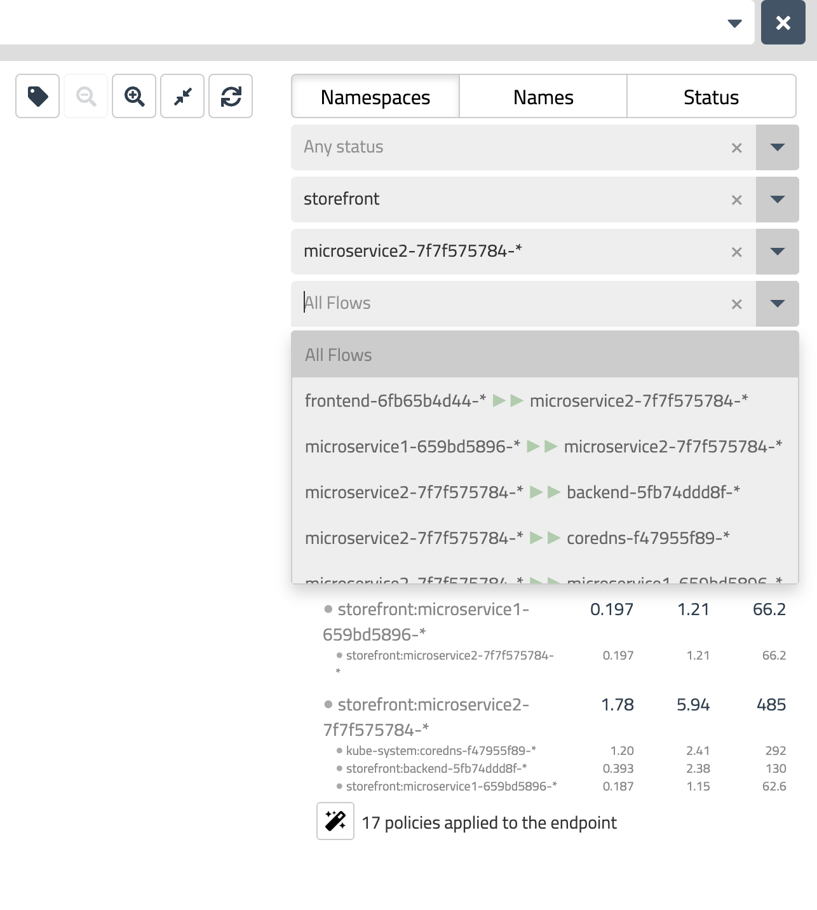

# East-West controls: Pod Microsegmentation

**Goal:** Configure a zone-based architecture for our storefront application, and understand how to troubleshoot with flow visualization.

## Steps


1. Implement policy for storefront app. 

    a. Create logging policy for storefront application in platform tier 
    ```bash
    ###apply the logging policy
    kubectl apply -f demo/101-security-controls/platform.allow-logging.yaml
    ```

    
    b. Create zone-based policy for storefront application.
    ```bash
    ###Check each mircoservice have proper zone-based label
    kubectl get pods -n storefront --show-labels 

    ###apply the zone-based policy
    kubectl apply -f demo/101-security-controls/storefront-FirewallZonesPolicies.yaml

    ```

   
2. Confirm the connection from microservice2 to backend are been allowed from flow visualization.

   
    


3. Change the lable of pod mircoservice2 and see the deny traffic in flow visualization. 

    ```bash

    #remove the label 
    kubectl -n storefront label pod $(kubectl -n storefront get po -l app=microservice2 -ojsonpath='{.items[0].metadata.name}') fw-zone-

    #add the label as dmz zone
    kubectl -n storefront label pod $(kubectl -n storefront get po -l app=microservice2 -ojsonpath='{.items[0].metadata.name}')  fw-zone=dmz
    ```

4. Confirm the connection from microservice2 to backend are been denied.

   


5. Reverse the lable of pod mircoservice2 with overwrite. 
   
   ```bash
    kubectl -n storefront label pod $(kubectl -n storefront get po -l app=microservice2 -ojsonpath='{.items[0].metadata.name}') fw-zone=trusted --overwrite
    ```


[Next -> DNS egress control](../modules/dns-egress-controls.md)

[Menu](../README.md)