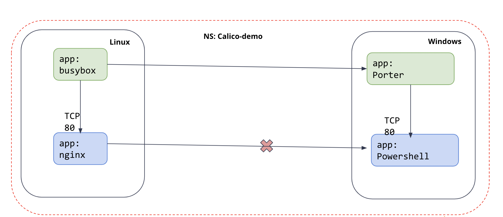

# Adding windows workload in your cluster and protect them with Calico policy
>Calico for Windows is a hybrid implementation that requires a Linux cluster for Calico components & Linux workloads, and Windows nodes for Windows workloads.

**Goal:** Create client and server pods on Linux and Windows nodes, verify connectivity between the pods, and then isolate pod traffic.

**Docs:** https://docs.tigera.io/getting-started/windows-calico/quickstart

## Steps

### For AKS cluster

1. Enable AKS windows Calico feature and register the service in your cluster. **Note:** This may take several minutes to complete, so it could be a good time for a coffee or lunch break.

    
    ```bash
    az feature register --namespace "Microsoft.ContainerService" --name "EnableAKSWindowsCalico"

    ```
    Output will be like this:
    ```bash
    {
      "id": "/subscriptions/03cfb895-358d-4ad4-8aba-aeede8dbfc30/providers/Microsoft.Features/providers/Microsoft.ContainerService/features/EnableAKSWindowsCalico",
      "name": "Microsoft.ContainerService/EnableAKSWindowsCalico",
      "properties": {
        "state": "Registered"
      },
      "type": "Microsoft.Features/providers/features"
    }
    ```


   Verify that the feature is registered. 

    ```bash
    az feature list -o table --query "[?contains(name, 'Microsoft.ContainerService/EnableAKSWindowsCalico')].{Name:name,State:properties.state}"
    ```
    
    Output will be
    ```bash
    Name                                               State
    -------------------------------------------------  ----------
    Microsoft.ContainerService/EnableAKSWindowsCalico  Registered
    ```


2. Refresh the registration of the Microsoft.ContainerService resource provider.

   ```bash
   az provider register --namespace Microsoft.ContainerService
   ```


3. Add a Windows node in your pool, and confirm the result.
   ```bash
   az aks nodepool add \
   --resource-group $RGNAME \
   --cluster-name $CLUSTERNAME \
   --os-type Windows \
   --name npwin  \
   --node-count 1 \
   --kubernetes-version $K8SVERSION \
   --node-vm-size Standard_D2s_v3
   ```
   
   ```bash
   kubectl get nodes
   ```

   ```bash
   ### The output is like:
   NAME                                STATUS   ROLES   AGE    VERSION
   aks-nodepool1-22704843-vmss000000   Ready    agent   111m   v1.21.7
   aks-nodepool1-22704843-vmss000001   Ready    agent   110m   v1.21.7
   aks-nodepool1-22704843-vmss000002   Ready    agent   110m   v1.21.7
   aksnpwin000000                      Ready    agent   84m    v1.21.7
   ```

4. Create demo pods in Linux and Windows nodes. Expected Outcome:
   - Create a client (busybox) and server (nginx) pod on the Linux nodes:
   - Create a client pod (powershell) and a server (porter) pod on the Windows nodes

    ```bash
   
    kubectl apply -f demo/win-demo/linux-pods.yaml
    kubectl apply -f demo/win-demo/win-pods.yaml
    ```
    
    ```bash
    # Windows images are large and can take some time to start
    kubectl get pods -o wide -n calico-demo
    ```

    ```text
    ### The output is like when ready:
    NAME      READY   STATUS    RESTARTS   AGE   IP            NODE                                NOMINATED NODE   READINESS GATES
    busybox   1/1     Running   0          88m   10.40.0.69    aks-nodepool1-22704843-vmss000002   <none>           <none>
    nginx     1/1     Running   0          88m   10.40.0.46    aks-nodepool1-22704843-vmss000001   <none>           <none>
    porter    1/1     Running   0          88m   10.40.0.109   aksnpwin000000                      <none>           <none>
    pwsh      1/1     Running   0          12m   10.40.0.100   aksnpwin000000                      <none>           <none>
    ```

5. Check the connectivities between pods. Expected Outcome:  
   - The traffic between `busybox` in Linux node and `porter` in Windows node is allowed. 
   - The traffic between `powershell` in Windows node and `nginx` in Linux node is allowed. 
   
   ```bash
   kubectl exec -n calico-demo busybox -- nc -vz $(kubectl get po porter -n calico-demo -o 'jsonpath={.status.podIP}') 80

   sleep 10

   kubectl exec -n calico-demo pwsh -- powershell Invoke-WebRequest -Uri http://$(kubectl get po nginx -n calico-demo -o 'jsonpath={.status.podIP}') -UseBasicParsing -TimeoutSec 5

   ```
  
   The output will be like:
   ```bash
   ##nc command output
   192.168.40.166 (192.168.40.166:80) open

   ##powershell command output
   StatusCode        : 200
   StatusDescription : OK
   
   ```

6. Create policy to explicitly allow the `busybox` pod in Linux node to reach the `porter` pod in Windows node, and deny the `powershell` pod in Windows node to reach the `nginx` pod in Linux node
   ```bash
   kubectl apply -f demo/win-demo/allow-busybox.yaml
   kubectl apply -f demo/win-demo/deny-nginx.yaml
   
   ```

7. Check the connectivities between pods. Expected Outcome:  
   - The traffic between `busybox` in Linux node and `porter` in Windows node is allowed. 
   - The traffic between `powershell` in Windows node and `nginx` in Linux node is denied.
  
    

   ```bash
   kubectl exec -n calico-demo busybox -- nc -vz $(kubectl get po porter -n calico-demo -o 'jsonpath={.status.podIP}') 80
   
   sleep 10

   kubectl exec -n calico-demo pwsh -- powershell Invoke-WebRequest -Uri http://$(kubectl get po nginx -n calico-demo -o 'jsonpath={.status.podIP}') -UseBasicParsing -TimeoutSec 5
   ```
   
   The output will be like:
   ```bash
   ##nc command output
   192.168.40.166 (192.168.40.166:80) open
 
   ##powershell command output 
   Invoke-WebRequest : The operation has timed out.
   ```

8. Check the connectivities from service graph and click the red arrow to see the deny flow log.

    

    


9. Delete the Windows node we create in your pool, and confirm the result.
   ```bash
   az aks nodepool delete \
   --resource-group $RGNAME \
   --cluster-name $CLUSTERNAME \
   --name npwin  \
   --no-wait
   ```

### For EKS cluster    

**Note:** Calico for Windows only supports AWS VPC CNI right now. 

1. Enable Windows support for your EKS cluster. 
 
   ```bash
   echo $IAM_ROLE ## It should be 'calicocloud-workshop-admin' as we configed before.
   aws iam list-attached-role-policies --role-name $IAM_ROLE
   ```
   
   The output will be like:
   ```bash
   {
    "AttachedPolicies": [
        {
            "PolicyName": "AdministratorAccess",
            "PolicyArn": "arn:aws:iam::aws:policy/AdministratorAccess"
        }
    ]
   }
   ```

2. Attach the AmazonEKSVPCResourceController managed policy to your Amazon EKS cluster IAM role. 

   ```bash
   aws iam attach-role-policy \
     --role-name $IAM_ROLE \
     --policy-arn arn:aws:iam::aws:policy/AmazonEKSVPCResourceController
   ```  

3. Create a file named vpc-resource-controller-configmap.yaml.
   ```bash
   cat > configs/vpc-resource-controller-configmap.yaml << EOF
   apiVersion: v1
   kind: ConfigMap
   metadata:
     name: amazon-vpc-cni
     namespace: kube-system
   data:
     enable-windows-ipam: "true"
   EOF

   ```
4. Apply the ConfigMap to your cluster.
   ```bash
   kubectl apply -f configs/vpc-resource-controller-configmap.yaml
   ```

5. Attach a self managed Windows node group to the cluster.

   ```bash
   eksctl create nodegroup \
   --region us-east-2 \
   --cluster win-calico-cluster \
   --name ng-windows \
   --node-type c5.large \
   --nodes 1 \
   --nodes-min 1 \
   --nodes-max 4 \
   --node-ami-family WindowsServer2019FullContainer --ssh-access --ssh-public-key=~/.ssh/id_rsa.pub --managed=false
   ```

   ```bash
   kubectl get nodes -o wide
   ```

   ```text
   NAME                                           STATUS   ROLES    AGE     VERSION               INTERNAL-IP      EXTERNAL-IP     OS-IMAGE                         KERNEL-VERSION                CONTAINER-RUNTIME
   ip-192-168-17-219.us-east-2.compute.internal   Ready    <none>   43m     v1.21.5-eks-bc4871b   192.168.17.219   18.190.24.194   Amazon Linux 2                   5.4.156-83.273.amzn2.x86_64   docker://20.10.7
   ip-192-168-39-125.us-east-2.compute.internal   Ready    <none>   2m14s   v1.21.5-eks-bc4871b   192.168.39.125   3.137.158.224   Windows Server 2019 Datacenter   10.0.17763.2366               docker://20.10.7
   ip-192-168-57-192.us-east-2.compute.internal   Ready    <none>   43m     v1.21.5-eks-bc4871b   192.168.57.192   3.138.111.75    Amazon Linux 2                   5.4.156-83.273.amzn2.x86_64   docker://20.10.7
   ```

6. Apply following user role binding to the cluster.
   
   ```bash
   cat > configs/ClusterRoleBinding-win.yaml << EOF
   apiVersion: rbac.authorization.k8s.io/v1
   kind: ClusterRoleBinding
   metadata:
     name: nodes-cluster-admin
   roleRef:
     apiGroup: rbac.authorization.k8s.io
     kind: ClusterRole
     name: cluster-admin
   subjects:
   - apiGroup: rbac.authorization.k8s.io
     kind: Group
     name: system:nodes
   EOF
   ```

   ```bash
   kubectl apply -f configs/ClusterRoleBinding-win.yaml
   ```

7. 

[Next -> Non K8S node segmentation](../modules/non-k8s-node-segmentation.md)

[Menu](../README.md)